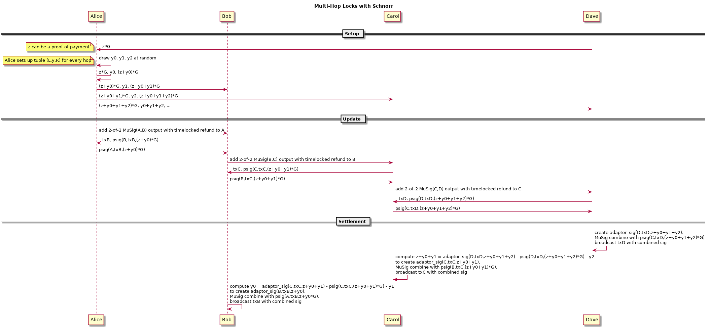

Multi-Hop Locks from Scriptless Scripts
===========================

Multi-hop locks are protocols that allow two parties to exchange coins and proof of payment without requiring a mutual funding multisig output.
Instead, they are connected through intermediate hops such that every hop has a shared funding multisig output with the next hop.
Multi-hop locks based on cryptographic hashes instead of scriptless scripts are used in the [Lightning Network protocol version 1.0](https://github.com/lightningnetwork/lightning-rfc) to route payments.

Multi-hop locksは、mutual funding multisig outputを必要とせずに、2者がコインとproof of paymentを交換できるようにするプロトコルです。
代わりに、各ホップがネクストホップとshared funding multisig outputを持つように、中間ホップを介して接続されます。
[Lightning Network protocol version 1.0]では、支払いをルーティングするために、scriptless scriptsではなくcryptographic hashesに基づくMulti-hop locksが使用されています。

Scriptless script multi-hop locks were introduced in a [post to the mimblewimble mailing list](https://lists.launchpad.net/mimblewimble/msg00086.html) and formally defined in the paper [Privacy-preserving Multi-hop Locks for Blockchain Scalability and Interoperability](https://eprint.iacr.org/2018/472.pdf).
By using scriptless scripts they result in smaller transactions which look like regular transactions and therefore improve privacy.
More importantly, they allow [payment decorrelation](https://medium.com/@rusty_lightning/decorrelation-of-lightning-payments-7b6579db96b0) which means that hops in a multi-hop lock can not determine (absent timing and coin amount analysis) if they are on the same path, i.e. they don't know if they are forwarding the same payment.
Correlation attacks are especially problematic if the first and last intermediate hops are colluding because they would learn source and destination of a payment.
In addition, scriptless script multi-hop locks enable improved proof of payment and atomic multi path payments (see below).

Scriptless script multi-hop locksは、[post to the mimblewimble mailing list]で導入され、[Privacy-preserving Multi-hop Locks for Blockchain Scalability and Interoperability]で正式に定義されています。
scriptless scriptsを使用することによって、それらは通常のトランザクションのように見え、それ故にプライバシーを改善するより小さなトランザクションをもたらします。
さらに重要なことに、それらは[支払いの無相関化]を与えます。これはmulti-hop lockのホップが（不在のタイミングとコインの量を（XXX: ???））決定できないことを意味します、それらが同じ経路上にあるかどうか。すなわち彼らが同じ支払いを送金しているかどうかわからない。
最初と最後の中間ホップが結託している場合、相関攻撃は特に問題になります。これは、支払いの送信元と送信先を学習するためです。
さらに、scriptless script multi-hop locksにより、proof of paymentとatomic multi path paymentsが向上します（下記参照）。

Notation
---
- `psig(i,m,T) := ki + H(R+T,m)*xi` is a partial 2-of-2 MuSig from user `i` for `m` with combined nonce `R` (note that `R` has nothing to do with the right lock `R` defined below and we won't use `R` to mean the nonce again).
- `adaptor_sig(i,m,T) := psig(i,m,t*G) + t`
- `sig(m,T) = psig(i,m,T) + adaptor_sig(j,m,T)` is the completed 2-of-2 MuSig from user i and j. It can be computed from a partial signature and an adaptor signature.

- `psig(i,m,T) := ki + H(R+T,m)*xi`は、結合nonce `R`と共に、`m`に対するユーザー`i`からの部分的な2-of-2 MuSigです（Rは、以下に定義されている右のロックRと関係がなく、我々は再びnonceを意味するためにRを使用しない）。
- `adaptor_sig(i,m,T) := psig(i,m,t*G) + t`
- `sig(m,T) = psig(i,m,T) + adaptor_sig(j,m,T)`は、ユーザーiとjからの完成した2-of-2 MuSigです。部分署名とアダプター署名から計算できます。

XXX: `R = ki*G + kj*G`だろう<br>
XXX: `sig(m,T) = psig(i,m,T) + adaptor_sig(j,m,T)`<br>
XXX: `sig(m,T) = psig(i,m,T) + psig(j,m,T) + t`<br>
XXX: = `ki + H(R+T,m)*xi + kj + H(R+T,m)*xj + t`<br>
XXX: = `ki + kj + t + H(R+T,m)*(xi+xj)`<br>

Protocol
---



XXX: 図の中でadaptor_sigの三番目の引数が点ではなく、スカラになっているのでおかしい。

In the setup phase the payee chooses `z` at random and sends the payer `z*G`.
The payer will set up the multi-hop locks such that a successful payment reveals `z` to her and only her.
Knowledge of `z` can be a proof of payment which is similar in concept to payment preimages in the Lightning v1.0 (see section below for details).

セットアップ段階において、受取人はランダムに`ｚ`を選び、支払人`ｚ*Ｇ`を送る。
支払人は、成功した支払いが彼女と彼女だけに `z`を明らかにするようにmulti-hop locksを設定します。
`z`を知っていることは、Lightning v1.0の支払いのプリイメージと概念が似ているproof of paymentとなります（詳細は以下のセクションを参照してください）。

We picture the payment starting from the payer on the left side through intermediate hops to the payee on the right side.
The setup phase continues with the payer setting up a tuple `(Li,yi,Ri)` consisting of the *left lock* `Li` and *right lock* `Ri` for every hop `i` in the following way:
Every `yi` is a scalar uniformly chosen at random.
The payers own left lock `L0` is set to `z*G` which was previously received from the payer.
Now for every lock `Ri` for hop `0<=i<n` and `Lj` for hop `j=i+1` the payer sets `Ri <- Li + yi*G` and `Lj <- Ri` (see the diagram).

XXX: drawは抽選する。<br>
左側の支払人から中間ホップを経て右側の受取人までの支払いを描写します。
以下のようにして、ホップ`i`毎に *left lock* `Li`と *right lock* `Ri`からなる組`(Li,yi,Ri)`を支払人が設定することでセットアップ段階が継続する。すべての`yi`は一様にランダムに選ばれたスカラです。
支払人自身の左ロック`L0`は、以前に支払人から受け取った`zG`に設定される。
今、ホップ`0<=i<n`に対するすべてのロック`Ri`およびホップ`j=i+1`に対する`Lj`に対して、支払人は`Ri <- Li + yi*G`および`Lj <- Ri`を設定する（図を参照）。

In the update phase adjacent hops add a multisig output to their off-chain transactions similar to how they would add an HTLC output in the Lightning v1.0.
Despite significant differences between v1.0 HTLCs and the outputs used to forward payments in scripless scripts multi-hop locks we continue to call the outputs HTLCs because they have the same purpose and work similarly on the surface.
Just like v1.0 HTLCs, scriptless script HTLCs have a time out condition such that the left hop can reclaim her coins if the payment fails.
But otherwise scriptless script HTLCs are plain 2-of-2 MuSig outputs and the hashlock is only implicitly added to the output only when a partial signature is received (see below).
For demonstration purposes we assume [eltoo](https://blockstream.com/eltoo.pdf)-style channels which means that both parties have symmetric state and there's no need for revocation.

更新フェーズでは、隣接ホップは、Lightning v1.0でHTLC出力を追加する方法と同様に、off-chain transactionsにマルチシグ出力を追加します。
v1.0 HTLCと、scripless scripts multi-hop locksを実行するための出力との間には大きな違いがありますが、出力は同じ目的を持ち、表面上も同様に機能するため、引き続きHTLCと呼びます。
v1.0 HTLCと同様に、scriptless script HTLCsには、支払いが失敗した場合に左ホップが自分のコインを取り戻すことができるようなタイムアウト条件があります。
しかしそれ以外、scriptless script HTLCsは単純な2-of-2 MuSig outputsであり、hashlockは部分的な署名が受信された場合にのみ暗黙的に出力に追加されます（下記参照）。
デモンストレーションを目的として、[eltoo]スタイルのチャンネルを想定しています。これは、両方の当事者が対称的な状態を持ち、失効の必要がないことを意味します。

If the payment does not time out, the coins in the scriptless script HTLC output shared by two adjacent hops will be spent by the right hop.
Therefore, the right hop `j` prepares a transaction `txj` spending the HTLC and partially signs it as `psig(j,txj,Lj)` which is similar to a regular partial signature except that its left lock `Lj` is added to the combined signature nonce.
The left hop verifies the partial signature and sends its own partial signature for `txj` to the right hop in the following two cases:

支払いがタイムアウトしない場合、隣接する2つのホップで共有されるscriptless script HTLC output内のコインが右ホップで消費されます。
したがって、右ホップ`j`は、HTLCを使用するトランザクション`txj`を準備し、結合署名nonceに左ロック`Lj`が追加されること以外は通常の部分署名と同様である`psig(j,txj,Lj)`として部分署名する。
以下の２つの場合には、左ホップは部分署名を検証し、それ自身の`txj`に対する部分署名を右ホップに送る。

XXX: `psig(j,txj,Lj) = kj + H(Rij+Lj,txj)*xj`<br>
XXX: `txj`はHTLC outputを消費するtx<br>
XXX: HTLC outputはmultisig

- the left hop is the payer
- the left hop `i` received a signature `psig(i-1, txi, T-yi*G)` from the preceding hop `i-1` for the left hops transaction `txi`. In combination with the partial signature just received from the right hop, it is guaranteed that as soon as the right hop spends the coins, the left hop can open its left lock and spend the coins with `txi` as we will see below.

- 左のホップは支払人です
- 左ホップ`ｉ`は、左ホップ・トランザクション`txi`に対して先行ホップ`i-1`から署名`psig(i-1, txi, T-yi*G)`を受信した。
右ホップから受け取った部分的署名との組み合わせで、右ホップがコインを使うとすぐに、左ホップは左ロックを開き、以下に示すように`txi`でコインを使うことができることが保証されます。

Therefore the update phase starts with the leftmost pair and continues to the right.
After receiving the partial signature from the left, the right hop can complete it as soon as it learns the secret of its left lock.
In order to reduce the overall number of communication rounds the setup phase and update phase can be merged together.

したがって、更新フェーズは左端のペアから始まり、右に続きます。
左から部分的な署名を受け取った後、右のホップは左の鍵の秘密を知るとすぐにそれを完成することができます。
全体的な通信ラウンド数を減らすために、セットアップ段階と更新段階とを併合することができる。

The settlement phase begins when the payee receives the partial signature from its left hop.
Because the multi-hop locks were set up by the payer such that the payee knows the secret of her left lock, she can use it as the adaptor secret and create an adaptor signature.
The adaptor signature is combined with the left hop's partial signature resulting in a final signature for the right hop's (the payee's) transaction.
At this point the right hop can broadcast the transaction to settle on-chain.

受取人が左ホップから部分的な署名を受け取ると、決済フェーズが始まります。
multi-hop locksは、支払い先が自分の左のロックの秘密を知っているように支払い元によって設定されているので、それをアダプタの秘密として使用してアダプタ署名を作成することができます。
アダプタ署名は、左ホップの部分署名と組み合わされて、右ホップ（受取人）の取引に対する最終的な署名となる。
この時点で、右ホップはトランザクションをブロードキャストして、チェーン上に決済することができます。

In this case the left hop notices the combined signature and learns its right lock secret by subtracting the right hop's previously received partial signature and its own partial signature.

この場合、左ホップは結合署名に気付き、右ホップの以前に受信された部分署名とそれ自身の部分署名とを減算することによってその右のロックシークレットを知る。

```
sig(tx,T) - psig(i,tx,Ri) - psig(j,tx,Lj) = adaptor_sig(j,tx,Lj) - psig(j,tx,Lj) = yj
```

XXX: Bob - Carol間で<br>
XXX: jホップ<br>
XXX: adaptor_sig(j,tx,Lj) - psig(j,tx,Lj) = yj<br>
XXX: iホップ<br>
XXX: sig(tx,T) - psig(i,tx,Ri) - psig(j,tx,Lj) = yj<br>

Alternatively, the right hop can send its secret `yj` directly to the left hop and request to update commitment (Lightning v1.0) or settlement (eltoo) transaction such that the HTLC is removed, the left hop's output amount is decreased by the payment amount and the right hop's output amount is increased by that amount.
If the left hop would not follow up with an update, the right hop can still broadcast the transaction until the HTLC times out.

あるいは、右ホップは、その秘密の`yj`を直接左ホップに送信し、HTLCが削除されるようにコミットメント（Lightning v1.0）またはsettlement（eltoo）トランザクションを更新するよう要求することができます。 支払い金額と右ホップのアウトプット金額はその金額分増加します。
左ホップが更新をフォローアップしない場合でも、右ホップはHTLCがタイムアウトするまでトランザクションをブロードキャストできます。

Either way, once the payee claims the payment, the left hop learns the right lock secret, computes its left lock secret by subtracting `yi`, computes an adaptor signature, and so on until the payer learns the proof of payment `z` which completes the payment.

いずれにしても、受取人が支払いを請求すると、左ホップは右ロックシークレットを学習し、その左ロックシークレットを `yi`を引くことにより計算し、アダプタ署名を計算し、その後支払人が支払い証明`z`を学習するまで 支払いを完了します。

Proof of Payment (PoP)
---
The main difference to Lightning v1.0 is that the proof of payment (`z`) is only obtained by the payer and not by every hop along the route.
Therefore, the proof of payment can be used to authenticate the payer to the payee.
It is not necessary to reveal the PoP itself but instead a signature of `z*G` can be provided.
Due to payment decorrelation intermediate hops can not associate a payment with the PoP.

Lightning v1.0との主な違いは、支払い証明（`z`）は支払い者によってのみ取得され、ルート上のすべてのホップによっては取得されないことです。
したがって、支払い証明は、支払い元を支払い先に認証するために使用できます。
PoP自体を明らかにする必要はないが、代わりに`z*G`の署名を提供することができる。
支払い非相関のため、中間ホップは支払いをPoPと関連付けることができません。

Obviously, not only the payer is able prove knowledge of `z`.
Everyone the payee or payer choose to share `z` with can do so too which makes it unclear who actually paid.
Therefore a signed statement (invoice) from payee should be sent to payer that includes `z*G` and the payers public key.
Then the PoP is both a signature with the PoP and the payers secret key which can only be provided by the payer (or everyone the payer chooses to collaborate with).

明らかに、支払人だけが`z`の知識を証明できるわけではありません。
受取人または支払人が `z`を共有することを選択した人は誰でもそうすることができ、実際に誰が支払ったのかが不明確になります。
したがって、受取人からの`z*G`と支払人の公開鍵を含む署名入りの明細書（請求書）を支払人に送ってください。
その場合、PoPは、PoPと支払人（または支払人が協力することを選択したすべての人）によってのみ提供されることができる支払人の秘密鍵の両方による署名です。

XXX: payerの公開鍵はnode_idである必要はなく、一時的な秘密鍵に対応するものでいいだろう。

Ideally a single static invoice would be payable by multiple parties allowing spontaneous payments without requiring extra communication with the payee.
But this is not compatible with PoPs because the PoP must be created from fresh randomness for every payment.
However, recurring payments from a single payer [can be done using hash chains](https://lists.linuxfoundation.org/pipermail/lightning-dev/2018-November/001496.html).

受取人との特別な連絡を必要とせずに、単一の静的請求書が複数の当事者から支払われて自発的な支払いが可能になるのが理想的だ。
しかし、これはPoPと互換性がありません。これは、PoPはすべての支払いに対して新しいランダム性から作成する必要があるためです。
ただし、1人の支払人からの定期的な支払いを[ハッシュチェーンを使用して行うことができます]。

Atomic Multipath Payments (AMP)
---
With scriptless script multi-hop locks it is possible to do AMP in a similarly to [*base AMP*](https://lists.linuxfoundation.org/pipermail/lightning-dev/2018-November/001577.html) while allowing payment decorrelation between the paths.
The payer sets up multiple routes to the payee using uncorrelated locks such that any partial payment claimed by the payee reveals the proof of payment (`z`) to the payer.
Because the payee doesn't want to give up the PoP for just a partial payment, she waits until all routes to her are fully established and claims the all partial payments at once.

scriptless script multi-hop locksでは、パス間の支払いの相関関係を可能にしながら[*base AMP*]と同様にAMPを実行することができます。
支払人が請求する部分支払いが支払人に支払い証明（`ｚ`）を明らかにするように、支払人は無相関ロックを使用して支払人への複数の経路を設定する。
受取人は、部分支払いのためだけにPoPをあきらめたくないので、彼女は、自分へのすべての経路が完全に確立されるまで待って、一度にすべての部分支払いを請求します。

Resources
---
* [Lightning Network protocol version 1.0](https://github.com/lightningnetwork/lightning-rfc)
* [Scripless Scripts in Lightning](https://lists.launchpad.net/mimblewimble/msg00086.html)
* [Privacy-preserving Multi-hop Locks for Blockchain Scalability and Interoperability](https://eprint.iacr.org/2018/472.pdf)
* [Payment Decorrelation](https://medium.com/@rusty_lightning/decorrelation-of-lightning-payments-7b6579db96b0)
* [eltoo](https://blockstream.com/eltoo.pdf)
* [Post-Schnorr Lightning Txs](https://lists.linuxfoundation.org/pipermail/lightning-dev/2018-February/001038.html)
* [Bolt11 in the world of Scriptless Scripts](https://lists.linuxfoundation.org/pipermail/lightning-dev/2018-November/001496.html)
* [Base AMP](https://lists.linuxfoundation.org/pipermail/lightning-dev/2018-November/001577.html)
